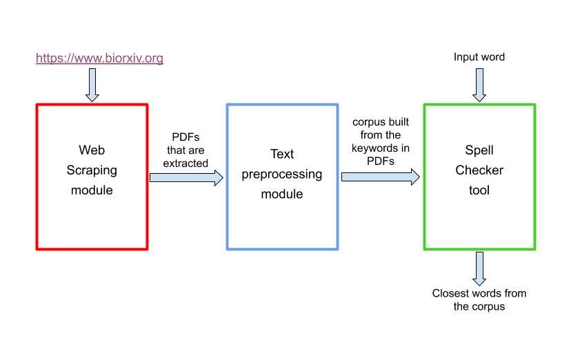

# Domain Spell Checker 

<p>The Domain specific Spell Checker tool mainly consists of three modules namely the Web scraping module, Text processing module and the Spell Checker tool.</p>

### Web Scraping module

<p>Web scraping module is used to access and download the papers hosted in the BioRxiv site. User has to enter the number of papers he wants to download and the file location where he wants to save the papers. </p>

### Text processing module

<p>This module is used to build word corpus from the extracted pdfs. User enters the file location where the papers are stored, number of papers to parse and the location where the corpus should be built.</p>

### Spell checker tool

<p>Scala implementation of Peter Norvig's algorithm for spell checker. This tool takes a word as inout and checks if it is spelled correctly. If the word is spelled incorrectly, it returns a possible set of suggestions to the user.</p>



## Setting up the project

This project uses scala version "2.12.8" and sbt version "1.3.8". It also uses jsoup, apache pdfbox, httpcomponents, scalatest and log4j logging dependencies. These can be found in the build.sbt file.

To set up the project, clone the master branch to the local. 
Run the following commands inside the directory.
```shell script
sbt compile
```

```shell script
sbt assembly
```


```shell script
sbt run
```
On running "sbt run", the main classes in the project are displayed. 


To perform web scraping, choose option 2. Enter the number of papers to download and the file location to save the papers. 


To parse pdfs and build the corpus, choose option 1. Enters the file location where the papers are stored, number of papers to parse and the location where the corpus should be built.


To use the Spell Checker functionality, choose option 3. Enter the owrd to check spelling and Q to exit out of tool.

